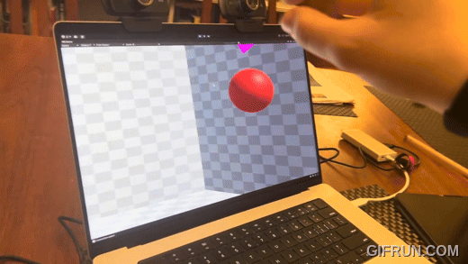
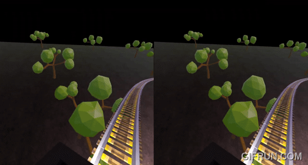
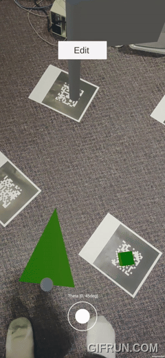
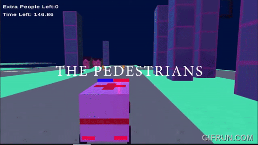
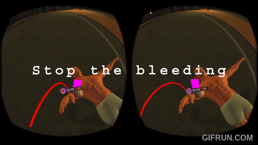
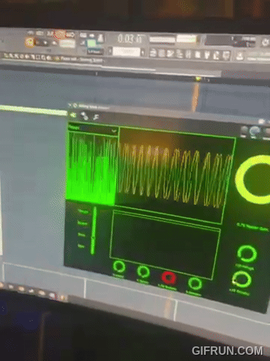

### Academic research
#### AR Lazer tag
- https://github.com/quantumech3/AR-Lazer-Tag
- https://github.com/quantumech3/decawave-interface

Video of project demo: https://www.youtube.com/watch?time_continue=31&v=gSiuyvAdZ-o&feature=emb_logo

##### Description
This was done with a former PhD student. On this project I wrote an algorithm, and a demo of the algorithm that solves the problem of "global localization" in AR. That is, I made it so 2 people can see the same virtual object in the same place in the real world. So if I shoot a lazer at you for example, you will see that lazer in the same place that I do, for example. This is nontrivial and I ended up implementing a naive visual inertial odometry (VIO) approach to solving this problem with ARCore cloud anchors and Unity. I single handedly did all of the implementation up to this point. We then started working on fusing VIO with a classical localization approach that uses beacons that trilaterate your position based on pings from RF transievers. I then recruited my friend `dyscott` and we worked together to write a library to interface with those transievers, called "Decawaves", over serial on Android. Neither interfacing with the Decawave or doing it over serial on Android were trivial because of poor documentation on both ends. I then used this interface with Unity to implement the algorithm for fusing the localization of the VIO approach and the RF approach. We implemented a game that showcases this technique.

#### XSB Prolog Web IDE
- https://github.com/quantumech3/XSB-Web-IDE
- https://github.com/quantumech3/XSB-Terminal-Lib
- https://github.com/quantumech3/XSB-JS-Interface

##### Description
With guidence from a professor from SBU, I singlehandedly ported an interpreter for a variant of a logic based programming language called "Prolog" to Web Assembly. I then built an entire IDE around it. It is still in progress today but my new updates are private at the moment in preparation for a paper hopefully 🤞.

#### Blood Platelet Project
- I cannot provide a public link, however here is a poster of our preliminary work. I did everything on the left side of the poster. I led a group of undergraduates to help me achieve this.

##### Description

#### POAM: Projected Off Axis Manipulation
I want to preface this codebase by saying that we started it as a hackathon project. We then came to a professor about it and turned it into a research project. That is why the codebase is messy. Additionally, we have a private branch that we are not allowed to show at this time. What you are about to see is an early prototype.

Here is a video of it: https://www.youtube.com/watch?v=zIOy9oAN_Y8

And here is the repository: https://github.com/quantumech3/hack-cewit-2024

##### Description
The following is our tentative abstract for this project:
> "We introduce a comprehensive approach to augment image-plane interaction with monoscopic displays by integrating hand and face tracking alongside off-axis projection. Our system facilitates a natural 3 DOF interaction on monoscopic displays. Users can interact with the display through a pinch-and-move gesture aided by vision based tracking algorithms. We use off-axis projection to dynamically adjust the content based on the user's viewpoint, creating the illusion of depth perception. Additionally, we conducted a user study to evaluate the effectiveness and usability of our approach compared to traditional interaction methods. Although image-plane interactions have had user studies, they have not been examined on monoscopic displays with an interaction paradigm that visually aligns the selection and manipulation with the user's perspective to the best of our knowledge. Our results demonstrate that our technique improves the accuracy, efficiency, and efficacy of image-plane interaction over using a traditional mouse and keyboard. Furthermore, our system opens up possibilities for diverse applications across various domains, including gaming, education, and productivity tools, by offering a more natural interaction paradigm."

### Industry
#### Kitware
- https://github.com/quantumech3/Danesfield

- https://github.com/quantumech3/kwiver

- https://github.com/quantumech3/TeleSculptor

##### Description
I worked at Kitware in 2021, and 2023 as a Computer Vision R&D intern. During my time there I worked on various projects at the company but the main focus was 3D reconstruction of terrain using various methods. In 2021 I worked on Telesculptor which uses classical feature detection and matching algorithms to generate point clouds and tesselations to reconstruct terrain based on areal footage. In 2023 I worked on Danesfield which used neural radience fields to reconstruct the terrain in a more robust manner. 

### CSE 366 (Intro to Virtual Reality)
Course page: https://www3.cs.stonybrook.edu/~cse366/
#### CSE 366 Homework 1 & 2 (homework 2 built off homework 1)
- Homework 1 requirements: https://github.com/quantumech3/366hw/blob/f3e44056782aec9fd88db49035d4863debd5c610/366hw1.pdf
- Homework 2 requirements (VR rollercoaster.. I got a little carried away 🤣): https://github.com/quantumech3/366hw/blob/f3e44056782aec9fd88db49035d4863debd5c610/366hw2.pdf
- Video of my homework 2 submission: https://www.youtube.com/watch?v=kBLcEDPtgbg

#### CSE 366 Homework 3
- Homework 3 (AR Golf game): https://github.com/quantumech3/366hw/blob/f3e44056782aec9fd88db49035d4863debd5c610/366hw3.pdf
- Video of homework 3 submission: https://www.youtube.com/watch?v=T_mnSeEi5uI

### Personal projects
#### Ambulance Simulator (Won funniest hack at SBU Hacks 2022)

https://devpost.com/software/ambulance-simulator
A game about an ambulance driver who forgot where the hospital is and needs to deliver his patient in a minute or the patient dies. You win by not running anyone over on the way. Easy.... right?

#### EMT Simulator (Won Best Game Dev at SBU Hacks 2024)

A game in virtual reality which simulates the experience of taking a patient, putting them on a stretcher, and hauling them into an ambulance. Easy.... right?
https://devpost.com/software/emergency-medical-technician-simulator

#### My personal website
https://quantumech3.github.io
Check it out! I am trying to get back into blogging and I hope to write about some interesting topics in the future. I recently discovered a programming language called Max which allows me to make my own realtime DSP algorithms while I am using them, rather then being compiled. I will probably be uploading some blogs about that once I get more familiar with it myself.

#### Sorting Synth
In high school, I implemented a FM based synth that uses intermediate steps in sorting algorithms to modulate the pitch of an oscillator in real time. I implemented many sorting algorithms to work with this. I used the JUCE framework in CPP to achieve this. I hope to get back into synth making now that I have Max MSP and Ableton. All parameters can be automated. I have other personal projects from high school but many of them were lost sadly. I liked making music visualizers, image filters, ray tracing, and physics simulations.

Video (with audio of the synth): https://www.youtube.com/watch?v=x-A9fYVrdME

#### Other interests
I am currently working on an electronic music/rock instrumental album. I post the songs as I work on them and I make all the cover art myself in Blender. I like playing with visual and DSP algorithms to create art with them.
https://soundcloud.com/quantumech/sets/as-her-wings-burn

I also do photography and other stuff along those lines. I enjoy making/playing video games from time to time. My personality can be summarized on the first blog of my personal website, hopefully not fully summarized though since I hope I am a more interesting person then that!

